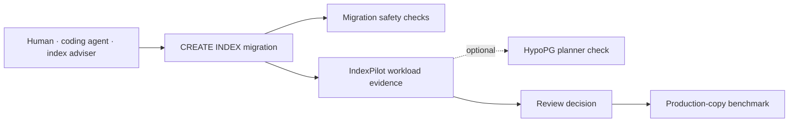

<p align="center">
  
</p>

# IndexPilot

<p align="center">
  <a href="https://github.com/eyeinthesky6/indexpilot/actions/workflows/ci.yml"></a>
  <a href="https://github.com/eyeinthesky6/indexpilot/releases/tag/v1.1.0a6"></a>
  <a href="https://www.python.org/"></a>
  <a href="https://github.com/eyeinthesky6/indexpilot/blob/main/LICENSE"></a>
  <a href="https://pepy.tech/projects/indexpilot"></a>
  <a href="https://github.com/eyeinthesky6/indexpilot"></a>
  <a href="https://github.com/eyeinthesky6/indexpilot/forks"></a>
</p>

## Stop bad PostgreSQL indexes before they reach production

**Check the exact `CREATE INDEX` in a migration against the workload your database actually runs.**

IndexPilot is a read-only PostgreSQL review CLI. It combines aggregate `pg_stat_statements`
evidence, comparable existing indexes, and optional HypoPG plans, then writes a cautious verdict
with Markdown, JSON, and optional SARIF evidence for the pull request.

Use it to answer practical questions:

- [Should I add this PostgreSQL index?](https://eyeinthesky6.github.io/indexpilot/use-cases/should-i-add-this-postgres-index/)
- [Does this migration add a duplicate index?](https://eyeinthesky6.github.io/indexpilot/use-cases/duplicate-postgres-index/)
- [Why might PostgreSQL ignore this index?](https://eyeinthesky6.github.io/indexpilot/use-cases/postgres-index-not-used/)
- [How can I test an index before creating it?](https://eyeinthesky6.github.io/indexpilot/use-cases/test-postgres-index-before-creating/)
- [How do I review index migrations in CI?](https://eyeinthesky6.github.io/indexpilot/use-cases/postgres-index-review-in-ci/)

> **Advisory only.** IndexPilot never applies the migration or creates a physical index. A positive
> result means “benchmark this next,” not “ship this automatically.”

[Website](https://eyeinthesky6.github.io/indexpilot/) ·
[Actual-use demo](https://app.arcade.software/share/ENmH1Og01OjwfF31JvGR) ·
[Quick start](#try-it-in-60-seconds) ·
[Local dashboard](#open-the-local-dashboard) ·
[Installation](https://github.com/eyeinthesky6/indexpilot/blob/main/docs/INSTALLATION.md) ·
[Documentation](https://github.com/eyeinthesky6/indexpilot/blob/main/docs/DOCUMENTATION_INDEX.md) ·
[GitHub Action](https://github.com/eyeinthesky6/indexpilot/blob/main/action.yml)

<p align="center">
  <a href="https://app.arcade.software/share/ENmH1Og01OjwfF31JvGR"></a>
</p>

<p align="center"><strong><a href="https://app.arcade.software/share/ENmH1Og01OjwfF31JvGR">Watch the real database-free review, from migration to decision</a></strong></p>

## Try it in 60 seconds

This database-free example proves the install and review path before you configure PostgreSQL:

```bash
git clone https://github.com/eyeinthesky6/indexpilot.git
cd indexpilot
uvx --from "indexpilot==1.1.0a6" indexpilot review --migration-file examples/quickstart/migration.sql --snapshot-file examples/quickstart/workload-snapshot.json --output artifacts/first-review.json --markdown-output artifacts/first-review.md --stdout
```

Expected result:

```text
Index statements reviewed: 1
Verdicts: {'existing_overlap': 1}
```

The example catches a proposed `(tenant_id, created_at)` index already covered by the sanitized
catalog. No database, credentials, Docker, or extension is used. See the
[installation guide](https://github.com/eyeinthesky6/indexpilot/blob/main/docs/INSTALLATION.md) if
`uvx` is unavailable. Prefer to see it first? The
[five-step actual-use walkthrough](https://app.arcade.software/share/ENmH1Og01OjwfF31JvGR)
shows the same migration, command, overlap verdict, and review artifacts.

## Review your migration

### 1. Install

```bash
pipx install "indexpilot==1.1.0a6"
indexpilot --version
```

### 2. Provide a read-only PostgreSQL connection

```bash
export DB_HOST=database.example.com
export DB_PORT=5432
export DB_NAME=my_app
export DB_USER=indexpilot_reader
export DB_PASSWORD='replace-me'
export DB_SSLMODE=require
```

The database needs `pg_stat_statements`. IndexPilot does not need `CREATE`, table writes, or
ownership.

### 3. Check readiness

```bash
indexpilot doctor --schema public --min-calls 10
```

### 4. Review the migration

```bash
indexpilot review \
  --migration-file migrations/add_orders_index.sql \
  --output artifacts/indexpilot.json \
  --markdown-output artifacts/indexpilot.md \
  --sarif-output artifacts/indexpilot.sarif
```

This first pass catches overlap and missing evidence. Add `--hypopg` when `doctor` confirms a
compatible PostgreSQL 16+ database and an installed HypoPG extension.

## Open the local dashboard

Install the optional API support, then start the packaged UI and API together:

```bash
pipx install "indexpilot[api]==1.1.0a6"
indexpilot dashboard
```

The command selects a free local port, opens `/dashboard/` in your browser, and stops when you
press `Ctrl+C`. It needs no Node.js process and no login because it binds only to `127.0.0.1`.
If PostgreSQL is not configured yet, the dashboard stays open and shows the missing connection.
Use `indexpilot api` with explicit bearer-token authentication for any non-loopback API bind.

For CI, the [composite GitHub Action](https://github.com/eyeinthesky6/indexpilot/blob/main/action.yml)
supports protected live review and database-free snapshot review. Fork workflows must load snapshot
evidence from the trusted base commit, never from the contributor checkout; follow the
[fork-safe workflow](https://github.com/eyeinthesky6/indexpilot/blob/main/docs/GITHUB_ACTIONS.md).

## How it fits with your existing tools

IndexPilot accepts an ordinary SQL migration file, so a human, coding agent, or index adviser can
propose the index. It then leaves standard report artifacts for CI and reviewers.



| Tool or step | What it contributes |
|---|---|
| Squawk or another migration linter | Checks whether the DDL is operationally safe |
| Dexter, an adviser, a developer, or an agent | Proposes a candidate index |
| **IndexPilot** | Checks whether that exact proposal has workload and overlap evidence |
| HypoPG | Provides the optional session-local hypothetical index mechanism |
| pgbench or your load test | Measures real latency, writes, size, and rollback before release |

These tools are complementary. IndexPilot does not automatically call every tool in the table; its
simple boundary is the migration SQL in and portable evidence out. See the
[tool-fit guide](https://github.com/eyeinthesky6/indexpilot/blob/main/docs/USAGE.md#how-indexpilot-fits-with-other-tools)
for details.

## How it works

1. **Parse locally.** SQLGlot reads the PostgreSQL index proposal without executing it.
2. **Read evidence.** IndexPilot collects aggregate workload patterns and comparable catalog indexes.
3. **Check the planner when requested.** HypoPG and `EXPLAIN`, never `EXPLAIN ANALYZE`, test a
   session-local hypothetical shape.
4. **Leave a decision record.** Each proposal receives a bounded verdict, evidence, limits, and next step.

The main verdicts are `worth_benchmarking`, `existing_overlap`,
`not_supported_by_current_planner_evidence`, and `inconclusive`. Their exact meaning and exit-code
behavior are documented in the [usage guide](https://github.com/eyeinthesky6/indexpilot/blob/main/docs/USAGE.md#verdicts).

## Safety boundary

- The public review path is read-only and never creates, drops, or reindexes a physical index.
- It runs `EXPLAIN`, never `EXPLAIN ANALYZE`.
- Reports contain query fingerprints rather than raw workload SQL.
- Planner cost is not measured production latency, and overlap is not automatic drop advice.
- Generated reports still contain object names and aggregate metadata; review them before sharing.

## Documentation

| Guide | Use it for |
|---|---|
| [Documentation hub](https://github.com/eyeinthesky6/indexpilot/blob/main/docs/DOCUMENTATION_INDEX.md) | Find the supported public documentation |
| [Installation](https://github.com/eyeinthesky6/indexpilot/blob/main/docs/INSTALLATION.md) | Python, PostgreSQL access, `pg_stat_statements`, and optional HypoPG |
| [CLI usage](https://github.com/eyeinthesky6/indexpilot/blob/main/docs/USAGE.md) | Commands, verdicts, syntax, outputs, privacy, and tool fit |
| [Trusted CI](https://github.com/eyeinthesky6/indexpilot/blob/main/docs/GITHUB_ACTIONS.md) | Protected live review and database-free fork review |
| [Security](https://github.com/eyeinthesky6/indexpilot/blob/main/SECURITY.md) | Credential, disclosure, and API boundaries |
| [Roadmap and limits](https://github.com/eyeinthesky6/indexpilot/blob/main/docs/ROADMAP.md) | Deferred evidence and compatibility work |
| [Agent skill](https://github.com/eyeinthesky6/indexpilot/blob/main/skills/review-postgres-index/SKILL.md) | Let a compatible coding agent install, test, and report the first result |

## Help and contribute

The hosted website uses cookie-free, aggregate Cloudflare Web Analytics for page visits,
referrers, paths, and performance. IndexPilot's CLI, GitHub Action, API, and local dashboard do
not send product-usage telemetry.

- After the first successful interactive review, IndexPilot prints one optional community link. It
  does not open the network or collect telemetry, never runs in CI or `--stdout` output, and can be
  disabled with `INDEXPILOT_NO_COMMUNITY_PROMPT=1`.
- Ask setup questions in [Q&A Discussions](https://github.com/eyeinthesky6/indexpilot/discussions/categories/q-a).
- Share an idea in [Ideas Discussions](https://github.com/eyeinthesky6/indexpilot/discussions/categories/ideas).
- Report a reproducible problem through the [issue forms](https://github.com/eyeinthesky6/indexpilot/issues/new/choose).
- Start contributing with [good first issues](https://github.com/eyeinthesky6/indexpilot/labels/good%20first%20issue)
  and [CONTRIBUTING.md](https://github.com/eyeinthesky6/indexpilot/blob/main/CONTRIBUTING.md).
- If your team reviews index migrations repeatedly, [share that workflow pain](https://github.com/eyeinthesky6/indexpilot/issues/new?template=team_workflow.yml)
  or read the [Team workflow preview](https://github.com/eyeinthesky6/indexpilot/blob/main/docs/TEAM_PREVIEW.md).

## License

IndexPilot is available under the [MIT License](https://github.com/eyeinthesky6/indexpilot/blob/main/LICENSE).
