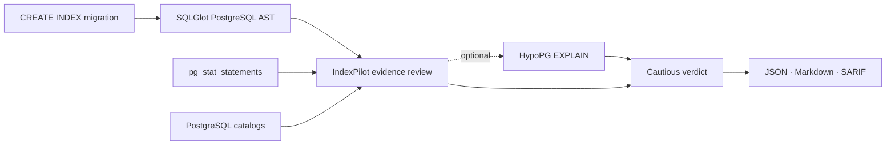

<p align="center">
  
</p>

# IndexPilot

[](https://github.com/eyeinthesky6/indexpilot/actions/workflows/ci.yml)
[](https://github.com/eyeinthesky6/indexpilot/releases/tag/v1.1.0a2)
[](https://www.python.org/)
[](https://github.com/eyeinthesky6/indexpilot/blob/main/LICENSE)

## Make every proposed PostgreSQL index earn its benchmark before merge

**IndexPilot is open-source, production-informed code review for PostgreSQL index migrations.**

It checks each proposed `CREATE INDEX` against the queries your database actually runs,
comparable existing indexes, and optional hypothetical plans. You get a cautious verdict plus
JSON and Markdown evidence, with optional SARIF. It does not apply the migration or create a
physical index.

> **Alpha and advisory-only.** IndexPilot answers “does this exact index have enough evidence to
> deserve a benchmark?” It does not claim that planner cost equals production latency.

[Website](https://eyeinthesky6.github.io/indexpilot/) ·
[Quick start](#quick-start) · [How it works](#how-it-works) ·
[Verdicts](#verdicts) · [Trusted CI](#trusted-ci) ·
[Documentation](#documentation)

[](https://eyeinthesky6.github.io/indexpilot/)

<p align="center">
  
</p>

---

- **Review the exact migration** rather than a generic recommendation.
- **Use real workload evidence** from `pg_stat_statements` and PostgreSQL catalogs.
- **Leave a portable decision record** in Markdown, JSON, and SARIF.

## Why IndexPilot?

A `CREATE INDEX` pull request looks simple, but the index becomes a permanent cost on writes,
storage, cache, backups, and maintenance. The hard question is not merely whether PostgreSQL can
build it. The question is whether your real workload supports building it.

| Tool category | Question it answers |
|---|---|
| Migration linter | Is this DDL operationally safe to run? |
| Index adviser | What indexes might improve this workload? |
| **IndexPilot** | **Does the exact index in this migration have enough evidence to benchmark?** |

IndexPilot sits at the pull-request decision point. It helps backend and platform teams reject
duplicate, unsupported, or weakly evidenced proposals before they become production baggage.

## Quick start

### 1. Install the release

Install the current alpha from PyPI in an isolated environment:

```bash
pipx install "indexpilot==1.1.0a2"
indexpilot --version
```

You can also install from the release tag:

```bash
pipx install "git+https://github.com/eyeinthesky6/indexpilot.git@v1.1.0a2"
```

The core CLI needs Python 3.10+; it does not need Docker, Node.js, the dashboard, API dependencies,
or ML dependencies. See the [full installation guide](https://github.com/eyeinthesky6/indexpilot/blob/main/docs/INSTALLATION.md)
for virtual environments and Windows setup.

### 2. Connect a read-only PostgreSQL role

```bash
export DB_HOST=database.example.com
export DB_PORT=5432
export DB_NAME=my_app
export DB_USER=indexpilot_reader
export DB_PASSWORD='replace-me'
export DB_SSLMODE=require
```

The database must expose `pg_stat_statements`. A monitoring role commonly receives
`pg_read_all_stats`; optional planner review also needs `SELECT` on the referenced relations.
IndexPilot does not need `CREATE`, table writes, or ownership.

### 3. Check the evidence source

```bash
indexpilot doctor --schema public --min-calls 10
```

`doctor` checks the connection, read-only transaction, PostgreSQL version,
`pg_stat_statements`, catalog visibility, representative workload, and HypoPG availability. A
real `--hypopg` review can still fail when relation or function privileges block `EXPLAIN`.

### 4. Review the migration

```sql
-- migrations/20260714_add_orders_index.sql
CREATE INDEX CONCURRENTLY idx_orders_tenant_created
ON public.orders (tenant_id, created_at);
```

```bash
indexpilot review \
  --migration-file migrations/20260714_add_orders_index.sql \
  --hypopg \
  --output artifacts/indexpilot.json \
  --markdown-output artifacts/indexpilot.md \
  --sarif-output artifacts/indexpilot.sarif
```

An illustrative successful review looks like this:

```text
IndexPilot migration review complete (advisory only).
Index statements reviewed: 1
Verdicts: {'worth_benchmarking': 1}
In-migration overlap findings: 0
JSON report: /work/artifacts/indexpilot.json
Markdown report: /work/artifacts/indexpilot.md
SARIF report: /work/artifacts/indexpilot.sarif
```

The positive verdict deliberately says **benchmark it**, not **ship it**.

## How it works



1. **Parse the proposal.** SQLGlot reads PostgreSQL syntax locally. IndexPilot normalizes the
   identifiers and never sends the supplied migration text to PostgreSQL.
2. **Read workload evidence.** Aggregate `pg_stat_statements` rows become query fingerprints;
   raw workload SQL is not written to reports.
3. **Check the catalog.** Existing valid, ready, ordinary B-trees are compared for exact and
   leading-prefix overlap.
4. **Test a hypothetical plan.** When requested, an already-installed HypoPG extension creates a
   session-local hypothetical shape and IndexPilot runs `EXPLAIN`, never `ANALYZE`.
5. **Leave a review artifact.** Each proposal receives a stable verdict with its evidence,
   limitations, and next step.

Migration files are reviewed in one pass. Proposals in the same schema share one catalog/workload
snapshot; a migration spanning schemas uses one snapshot per referenced schema. Non-index
statements are counted but never executed.

## What it catches

- an existing comparable index with the same leading prefix;
- exact duplicates, leading-prefix overlap, and duplicate index names inside one migration;
- no observed workload using the proposal's leading column;
- a hypothetical index the representative plan does not select;
- planner improvement below the current advisory threshold;
- missing, stale, or insufficient workload evidence;
- index shapes the current reviewer cannot represent faithfully.

Unsupported input fails with its statement number instead of being silently approximated.

## Verdicts

| Verdict | What the evidence says | Recommended next step |
|---|---|---|
| `worth_benchmarking` | The exact hypothetical index was selected and passed the advisory planner-cost threshold | Benchmark latency, writes, build time, size, cache behavior, and rollback on a production copy |
| `existing_overlap` | A comparable existing B-tree already has the same leading prefix | Inspect both shapes; this is manual-review evidence, never safe-to-drop proof |
| `not_supported_by_current_planner_evidence` | HypoPG completed, but the exact shape was unused or below the threshold | Inspect the plan or test another shape; do not infer that the index is harmful |
| `inconclusive` | Workload or planner evidence was missing or insufficient | Collect representative traffic, fix access, or enable optional HypoPG review |

Current HypoPG review plans one representative query per candidate. It is not a full workload
regression test.

Overlap inside one migration is recorded separately in `migration_overlap_findings`. It does not
change an individual proposal's verdict, but it does match `--fail-on existing_overlap`.

## Command map

| Command | Purpose | Database access |
|---|---|---|
| `indexpilot doctor` | Check whether the database can provide useful review evidence | Read-only |
| `indexpilot review --migration-file ...` | Review every supported index proposal in a migration | Read-only |
| `indexpilot review --candidate-sql ...` | Review one exact proposed index | Read-only |
| `indexpilot review` | Discover repeated equality-plus-range/order candidates | Read-only |
| `indexpilot audit` | Find cautious exact or leading-prefix overlap among existing B-trees | Catalog-only; `pg_stat_statements` is not required |
| `indexpilot compare before.json after.json` | Check offline whether PostgreSQL later recorded scans on the exact shape | None |
| `indexpilot dna` | Write the compatibility workload-DNA JSON report | Read-only |
| `indexpilot api` | Run the optional authenticated single-operator dashboard API | Separate optional surface |

Run `indexpilot <command> --help` for every option. The
[usage guide](https://github.com/eyeinthesky6/indexpilot/blob/main/docs/USAGE.md)
documents report fields, exit codes, proposal syntax, and examples.

## Trusted CI

IndexPilot can turn weak evidence into an opt-in CI failure while still writing the reports:

```bash
indexpilot review \
  --migration-file migrations/add_orders_index.sql \
  --hypopg \
  --output artifacts/indexpilot.json \
  --markdown-output artifacts/indexpilot.md \
  --sarif-output artifacts/indexpilot.sarif \
  --fail-on existing_overlap \
  --fail-on inconclusive
```

`--fail-on` is repeatable. A matched verdict exits with code `3` after the evidence artifacts
are written; ordinary completed advisory reports exit with code `0`.

> **Protect database credentials.** Do not expose a production or staging secret to code from an
> untrusted fork pull request. Run IndexPilot on a protected branch, with `workflow_dispatch`
> against a reviewed commit, or against a sanitized throwaway database.

Use the [trusted GitHub Actions recipe](https://github.com/eyeinthesky6/indexpilot/blob/main/docs/GITHUB_ACTIONS.md)
for the complete least-privilege workflow.

## Safety and privacy contract

| Boundary | What IndexPilot does |
|---|---|
| Database transaction | Sets the evidence-collection transaction to read-only |
| Supplied SQL | Parses locally and rebuilds safe hypothetical SQL from normalized identifiers |
| Physical DDL | Never creates, drops, cleans up, or reindexes a physical index in the public review path |
| HypoPG | Uses session-local hypothetical indexes and resets them before and after review |
| Planner | Runs `EXPLAIN`, never `EXPLAIN ANALYZE` |
| Extensions | Uses `pg_stat_statements` and optional HypoPG only when already installed |
| Existing-index audit | Reports overlap and usage counters; never produces drop advice |
| Reports | Exclude raw workload SQL; include fingerprints, normalized proposals, object names, counts, and size metadata |

Generated artifacts can still reveal schema and workload metadata. Review them before posting them
publicly.

## Supported proposals

The alpha intentionally accepts a narrow shape:

```sql
CREATE INDEX [CONCURRENTLY] [IF NOT EXISTS] [name]
ON [schema.]table (column [, column ...]);
```

That means one non-unique, ascending B-tree with plain column keys. Partial, expression,
`INCLUDE`, `UNIQUE`, descending, and specialized index shapes are rejected because they carry
different physical meaning. See the [supported syntax](https://github.com/eyeinthesky6/indexpilot/blob/main/docs/USAGE.md#supported-proposal-syntax)
for the full boundary.

## How IndexPilot fits with advanced tools

IndexPilot is designed to complement the PostgreSQL ecosystem:

| Tool | Reach for it when... |
|---|---|
| [Squawk](https://squawkhq.com/) | You want static migration-safety rules |
| [Dexter](https://github.com/ankane/dexter) | You want an automatic index candidate generator |
| [HypoPG](https://github.com/HypoPG/hypopg) | You want the raw hypothetical-index mechanism |
| [pganalyze Index Advisor](https://pganalyze.com/docs/index-advisor/getting-started) | You want managed, workload-wide monitoring and advice |
| **IndexPilot** | You want a local, inspectable evidence gate for the exact index in a migration |

The useful pairing is simple:

> A migration linter checks whether an index is safe to build. IndexPilot checks whether that exact
> index is justified enough to benchmark.

## Requirements and limits

- Python 3.10-3.13 is tested in CI.
- PostgreSQL with `pg_stat_statements` is required for workload review.
- PostgreSQL 16+ and an already-installed HypoPG extension are required only for the current
  placeholder-safe planner comparison.
- Workload statistics must cover representative traffic; a quiet or recently reset window can
  only produce weak evidence.
- IndexPilot does not yet measure real latency, write amplification, physical bloat, index build
  duration, deployed size, cache effects, or rollback time.
- The optional API uses one shared operator token. It is not hosted multi-user authentication.

See the [roadmap](https://github.com/eyeinthesky6/indexpilot/blob/main/docs/ROADMAP.md)
for production-copy replay, richer index shapes, offline workload snapshots, and PyPI Trusted
Publishing.

## Documentation

| Guide | Use it for |
|---|---|
| [Installation](https://github.com/eyeinthesky6/indexpilot/blob/main/docs/INSTALLATION.md) | PostgreSQL setup, least-privilege access, HypoPG, and common errors |
| [CLI usage](https://github.com/eyeinthesky6/indexpilot/blob/main/docs/USAGE.md) | Commands, verdicts, report fields, privacy, and exit codes |
| [Trusted CI](https://github.com/eyeinthesky6/indexpilot/blob/main/docs/GITHUB_ACTIONS.md) | GitHub Actions without unsafe secret exposure |
| [Architecture](https://github.com/eyeinthesky6/indexpilot/blob/main/docs/codebase/ARCHITECTURE.md) | Runtime flow and module ownership |
| [Known concerns](https://github.com/eyeinthesky6/indexpilot/blob/main/docs/codebase/CONCERNS.md) | Honest launch gaps and technical risks |
| [Roadmap](https://github.com/eyeinthesky6/indexpilot/blob/main/docs/ROADMAP.md) | Planned evidence upgrades and deliberately deferred work |
| [Changelog](https://github.com/eyeinthesky6/indexpilot/blob/main/CHANGELOG.md) | Public package changes |

## Development

```bash
git clone https://github.com/eyeinthesky6/indexpilot.git
cd indexpilot
python -m venv .venv
python -m pip install -e ".[dev,api,ml]"
python -m pytest tests -q
python scripts/check_unsafe_db_access.py
python -m build
```

Database-backed tests use the PostgreSQL service in `docker-compose.yml`. The optional dashboard
is tested separately under `ui/`.

IndexPilot is early, deliberately narrow, and open to contributors. A useful first change can be a
focused test, a clearer example, a PostgreSQL compatibility report, or a small fix. You do not need
to understand the historical research modules before helping with the supported CLI.

Start with [good first issues](https://github.com/eyeinthesky6/indexpilot/labels/good%20first%20issue)
or [help wanted](https://github.com/eyeinthesky6/indexpilot/labels/help%20wanted), then read
[CONTRIBUTING.md](https://github.com/eyeinthesky6/indexpilot/blob/main/CONTRIBUTING.md). Use the
[issue tracker](https://github.com/eyeinthesky6/indexpilot/issues) for bugs and proposals. Report
vulnerabilities privately through
[SECURITY.md](https://github.com/eyeinthesky6/indexpilot/blob/main/SECURITY.md).

## Release status

[`v1.1.0a2`](https://github.com/eyeinthesky6/indexpilot/releases/tag/v1.1.0a2) is the current
focused, installable evaluation release. It is an alpha, not a supported production service. The
older `v1.0.0-stable` tag predates the focused package contract and remains historical.

## License

IndexPilot is available under the [MIT License](https://github.com/eyeinthesky6/indexpilot/blob/main/LICENSE).
