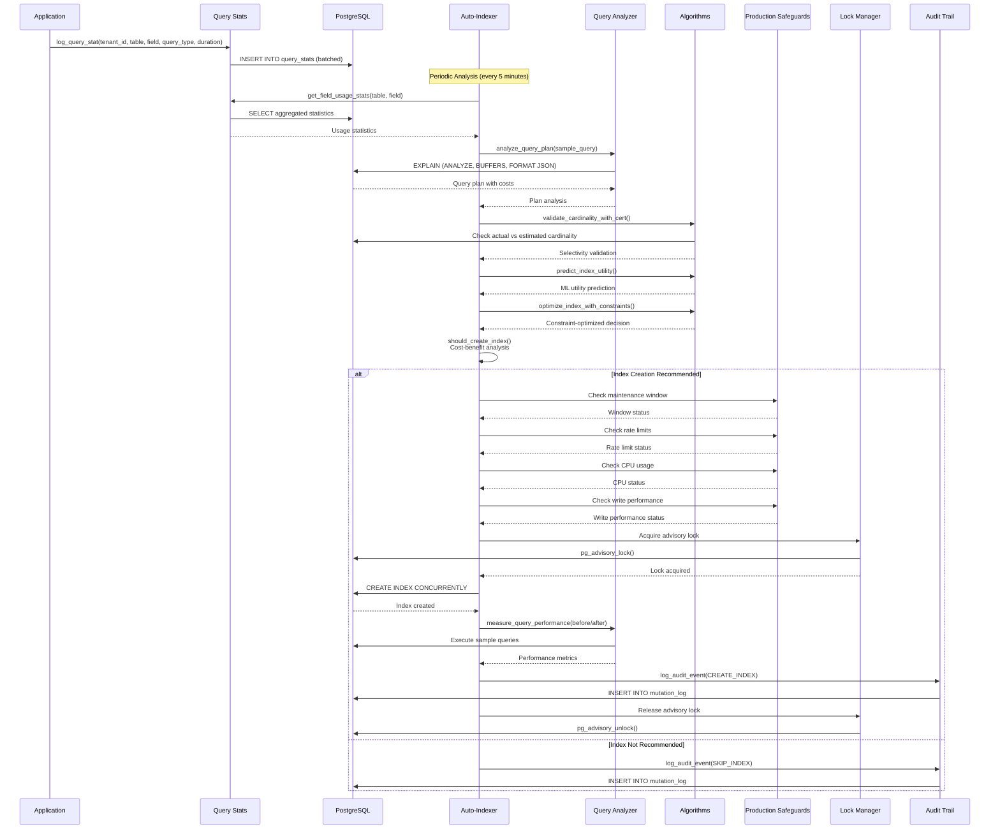
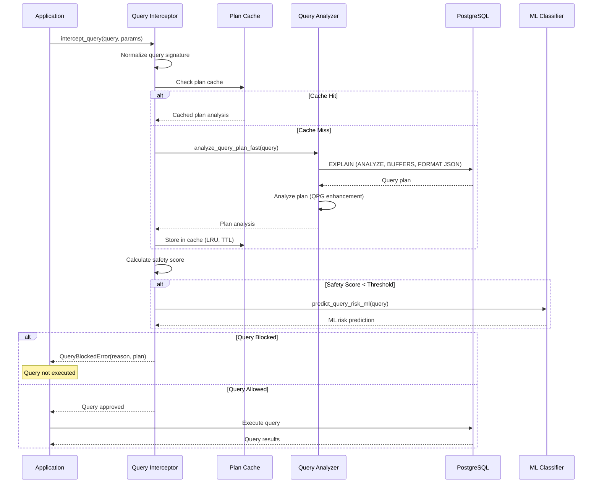
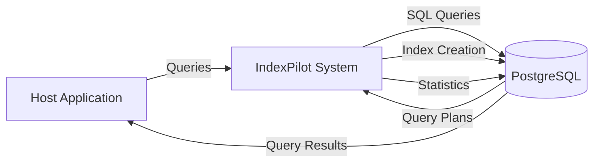
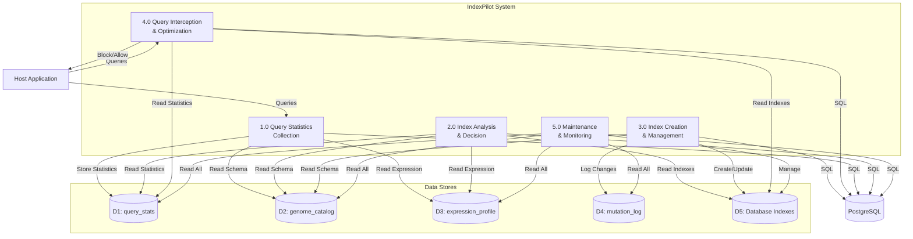
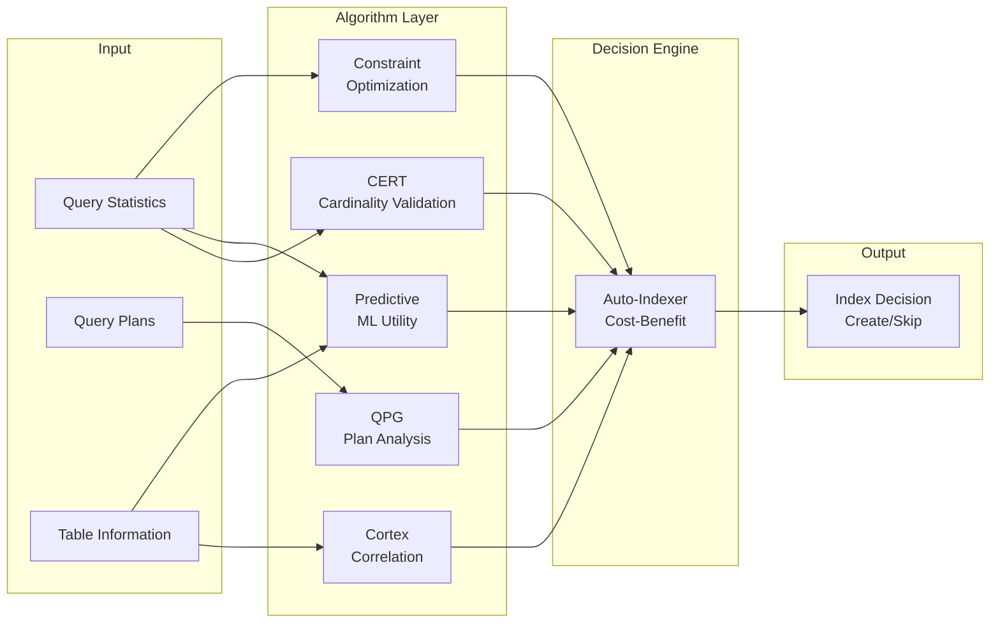

# IndexPilot - Architecture Diagrams

**Date**: 08-12-2025  
**Purpose**: Visual architecture diagrams for IndexPilot system  
**Status**: ✅ Complete

---

## System Architecture Overview

```mermaid
graph TB
    subgraph "Client Layer"
        UI[Next.js Dashboard<br/>Performance, Health, Decisions]
        Browser[Web Browser]
    end
    
    subgraph "API Layer"
        API[FastAPI Server<br/>REST API Endpoints<br/>Port 8000]
        OpenAPI[OpenAPI/Swagger Docs<br/>/docs, /redoc]
    end
    
    subgraph "IndexPilot Control Layer"
        subgraph "Core Components"
            Genome[Genome Catalog<br/>Canonical Schema]
            Expression[Expression Profiles<br/>Per-Tenant Activation]
            Stats[Query Statistics<br/>Performance Metrics]
            AutoIndexer[Auto-Indexer<br/>Cost-Benefit Analysis]
        end
        
        subgraph "Production Safeguards"
            LockMgr[Lock Manager]
            RateLimit[Rate Limiter]
            CPUThrottle[CPU Throttle]
            MaintWindow[Maintenance Window]
            WritePerf[Write Performance]
        end
        
        subgraph "Query Optimization"
            QueryAnalyzer[Query Analyzer<br/>EXPLAIN Analysis]
            QueryInterceptor[Query Interceptor<br/>Proactive Blocking]
            PatternDetect[Pattern Detection]
        end
        
        subgraph "Academic Algorithms"
            CERT[CERT]
            QPG[QPG]
            Cortex[Cortex]
            Predictive[Predictive Indexing]
            XGBoost[XGBoost]
            PGM[PGM-Index]
            ALEX[ALEX]
            RSS[RadixStringSpline]
            Fractal[Fractal Tree]
            iDist[iDistance]
            BxTree[Bx-tree]
            Constraint[Constraint Optimizer]
        end
        
        subgraph "Operational"
            Maintenance[Maintenance Tasks<br/>13+ Steps]
            Health[Health Checks]
            Monitoring[Monitoring]
            Audit[Audit Trail]
        end
    end
    
    subgraph "Database Layer"
        DB[(PostgreSQL Database)]
        subgraph "Metadata Tables"
            GenomeCatalog[genome_catalog]
            ExpressionProfile[expression_profile]
            MutationLog[mutation_log]
            QueryStats[query_stats]
        end
        subgraph "Business Tables"
            Tenants[tenants]
            Contacts[contacts]
            Organizations[organizations]
            Interactions[interactions]
        end
        Indexes[(Auto-Created Indexes)]
    end
    
    Browser -->|HTTP| UI
    UI -->|HTTP/REST| API
    API -->|Calls| AutoIndexer
    API -->|Calls| Health
    API -->|Calls| Stats
    API -->|Calls| QueryAnalyzer
    OpenAPI -->|Documentation| API
    
    AutoIndexer -->|Uses| Stats
    AutoIndexer -->|Uses| QueryAnalyzer
    AutoIndexer -->|Uses| PatternDetect
    AutoIndexer -->|Uses| CERT
    AutoIndexer -->|Uses| Predictive
    AutoIndexer -->|Uses| Constraint
    
    QueryAnalyzer -->|Uses| QPG
    PatternDetect -->|Uses| Cortex
    PatternDetect -->|Uses| iDist
    PatternDetect -->|Uses| BxTree
    
    AutoIndexer -->|Checks| LockMgr
    AutoIndexer -->|Checks| RateLimit
    AutoIndexer -->|Checks| CPUThrottle
    AutoIndexer -->|Checks| MaintWindow
    AutoIndexer -->|Checks| WritePerf
    
    Maintenance -->|Uses| Stats
    Maintenance -->|Uses| QueryAnalyzer
    Maintenance -->|Uses| Multiple Algorithms
    
    AutoIndexer -->|Creates| Indexes
    QueryInterceptor -->|Blocks| DB
    QueryAnalyzer -->|Analyzes| DB
    
    Stats -->|Stores| QueryStats
    Genome -->|Stores| GenomeCatalog
    Expression -->|Stores| ExpressionProfile
    Audit -->|Stores| MutationLog
    
    DB -->|Contains| GenomeCatalog
    DB -->|Contains| ExpressionProfile
    DB -->|Contains| MutationLog
    DB -->|Contains| QueryStats
    DB -->|Contains| Tenants
    DB -->|Contains| Contacts
    DB -->|Contains| Organizations
    DB -->|Contains| Interactions
    DB -->|Contains| Indexes
```

---

## Component Dependency Diagram

```mermaid
graph TD
    subgraph "Base Layer"
        DB[db.py<br/>Connection Pool]
        Config[config_loader.py<br/>Configuration]
        Types[type_definitions.py<br/>Type Definitions]
    end
    
    subgraph "Core Layer"
        Stats[stats.py]
        Genome[genome.py]
        Expression[expression.py]
        Validation[validation.py]
        Rollback[rollback.py]
    end
    
    subgraph "Query Layer"
        QueryAnalyzer[query_analyzer.py]
        QueryInterceptor[query_interceptor.py]
        QueryPatterns[query_patterns.py]
        PatternDetect[pattern_detection.py]
    end
    
    subgraph "Index Layer"
        AutoIndexer[auto_indexer.py]
        IndexType[index_type_selection.py]
        IndexHealth[index_health.py]
        IndexCleanup[index_cleanup.py]
    end
    
    subgraph "Algorithm Layer"
        CERT[algorithms/cert.py]
        QPG[algorithms/qpg.py]
        Cortex[algorithms/cortex.py]
        Predictive[algorithms/predictive_indexing.py]
        Constraint[algorithms/constraint_optimizer.py]
    end
    
    subgraph "Production Layer"
        LockMgr[lock_manager.py]
        RateLimit[rate_limiter.py]
        CPUThrottle[cpu_throttle.py]
        MaintWindow[maintenance_window.py]
        WritePerf[write_performance.py]
    end
    
    subgraph "Operational Layer"
        Maintenance[maintenance.py]
        Health[health_check.py]
        Monitoring[monitoring.py]
        Audit[audit.py]
    end
    
    subgraph "Integration Layer"
        API[api_server.py]
        Simulator[simulator.py]
    end
    
    DB --> Stats
    DB --> Genome
    DB --> Expression
    DB --> QueryAnalyzer
    DB --> AutoIndexer
    
    Config --> Stats
    Config --> AutoIndexer
    Config --> QueryAnalyzer
    Config --> Maintenance
    
    Stats --> AutoIndexer
    Genome --> Expression
    Validation --> Stats
    Validation --> AutoIndexer
    Rollback --> Stats
    Rollback --> AutoIndexer
    
    QueryAnalyzer --> QueryInterceptor
    QueryAnalyzer --> AutoIndexer
    QueryPatterns --> AutoIndexer
    PatternDetect --> AutoIndexer
    
    QPG --> QueryAnalyzer
    CERT --> AutoIndexer
    Cortex --> PatternDetect
    Predictive --> AutoIndexer
    Constraint --> AutoIndexer
    
    LockMgr --> AutoIndexer
    RateLimit --> AutoIndexer
    CPUThrottle --> AutoIndexer
    MaintWindow --> AutoIndexer
    WritePerf --> AutoIndexer
    
    Maintenance --> Stats
    Maintenance --> QueryAnalyzer
    Maintenance --> AutoIndexer
    Maintenance --> IndexHealth
    Maintenance --> IndexCleanup
    Maintenance --> Multiple Algorithms
    
    AutoIndexer --> API
    Stats --> API
    Health --> API
    
    Simulator --> AutoIndexer
    Simulator --> Stats
    Simulator --> Expression
```

---

## Index Creation Flow (Sequence Diagram)



---

## Query Interception Flow (Sequence Diagram)



---

## Maintenance Workflow (Flowchart)

```mermaid
flowchart TD
    Start([Maintenance Task<br/>Triggered]) --> CheckBypass{Maintenance<br/>Enabled?}
    CheckBypass -->|No| End([Skip Maintenance])
    CheckBypass -->|Yes| Step1[Step 1: System Health Check]
    
    Step1 --> Step2[Step 2: Database Integrity Check]
    Step2 --> Step3[Step 3: Connection Pool Health]
    Step3 --> Step4[Step 4: Index Creation Analysis]
    
    Step4 --> Step5[Step 5: Index Health Monitoring]
    Step5 --> Step6[Step 6: Unused Index Detection]
    Step6 --> Step7[Step 7: Automatic REINDEX Scheduling]
    
    Step7 --> Step8[Step 8: Query Pattern Learning]
    Step8 --> Step9[Step 9: Statistics Refresh]
    Step9 --> Step10[Step 10: Redundant Index Detection]
    
    Step10 --> Step11[Step 11: Workload Analysis]
    Step11 --> Step12[Step 12: Foreign Key Suggestions]
    Step12 --> Step13[Step 13: Concurrent Index Monitoring]
    
    Step13 --> Step14[Step 14: Materialized View Support]
    Step14 --> Step15[Step 15: Safeguard Monitoring]
    Step15 --> Step16[Step 16: Predictive Maintenance]
    
    Step16 --> Step17[Step 17: ML Query Interception Training]
    Step17 --> LogResults[Log Results to Audit Trail]
    LogResults --> End([Maintenance Complete])
    
    style Start fill:#90EE90
    style End fill:#90EE90
    style CheckBypass fill:#FFE4B5
```



---

## Data Flow Diagram (Level 0 - Context)



---

## Data Flow Diagram (Level 1 - Main Processes)



---

## Algorithm Integration Flow



---

## Notes

1. **Diagram Format**: All diagrams use Mermaid syntax for easy rendering in Markdown viewers
2. **Rendering**: Diagrams can be viewed in:
   - GitHub/GitLab (native support)
   - VS Code with Mermaid extension
   - Online Mermaid editor: https://mermaid.live
3. **Maintenance**: Update diagrams when architecture changes
4. **Version**: Diagrams reflect architecture as of 08-12-2025

---

**Last Updated**: 08-12-2025  
**Status**: ✅ Complete

