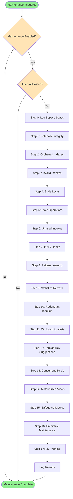

# Maintenance Workflow Documentation

**Date**: 08-12-2025  
**Purpose**: Complete documentation of all maintenance tasks and workflow  
**Status**: ✅ Complete

---

## Overview

The maintenance system (`src/maintenance.py`) runs periodic tasks to ensure database integrity, optimize performance, and maintain system health. Maintenance runs automatically every hour (configurable) and includes 17 distinct steps.

**Entry Point**: `run_maintenance_tasks(force: bool = False)`

**Default Interval**: 1 hour (3600 seconds)  
**Configuration**: `operational.maintenance_tasks.enabled` (can be disabled)

---

## Maintenance Steps

### Step 0: Bypass Status Logging

**Purpose**: Log bypass status for user visibility

**Implementation**: Calls `log_bypass_status(include_details=False)`

**Frequency**: Every maintenance run

**Output**: Logs current bypass status to help users understand system state

---

### Step 1: Database Integrity Check

**Purpose**: Verify database metadata consistency

**Implementation**: `check_database_integrity()`

**What It Checks**:
- Metadata table consistency
- Index references validity
- Foreign key integrity
- Schema consistency

**Frequency**: Every maintenance run

**Output**: 
- `integrity_check.status`: "healthy" or "unhealthy"
- `integrity_check.issues`: List of issues found

**Alerts**: Warning if issues detected

---

### Step 2: Clean Up Orphaned Indexes

**Purpose**: Remove indexes that reference non-existent tables/columns

**Implementation**: `cleanup_orphaned_indexes()`

**What It Does**:
- Finds indexes pointing to dropped tables/columns
- Removes orphaned indexes safely
- Logs cleanup actions

**Frequency**: Every maintenance run

**Output**: 
- `cleanup.orphaned_indexes`: Number of indexes cleaned up

**Alerts**: Info alert when indexes are cleaned up

---

### Step 3: Clean Up Invalid Indexes

**Purpose**: Remove indexes that are corrupted or invalid

**Implementation**: `cleanup_invalid_indexes()`

**What It Does**:
- Identifies invalid/corrupted indexes
- Removes invalid indexes safely
- Logs cleanup actions

**Frequency**: Every maintenance run

**Output**: 
- `cleanup.invalid_indexes`: Number of indexes cleaned up

**Alerts**: Warning alert when indexes are cleaned up

---

### Step 4: Clean Up Stale Advisory Locks

**Purpose**: Remove abandoned advisory locks from crashed processes

**Implementation**: `cleanup_stale_advisory_locks()`

**What It Does**:
- Finds advisory locks older than 5 minutes
- Releases stale locks
- Prevents lock accumulation

**Frequency**: Every maintenance run

**Output**: 
- `cleanup.stale_advisory_locks`: Number of locks cleaned up

**Alerts**: Info alert when locks are cleaned up

---

### Step 5: Check for Stale Operations

**Purpose**: Identify operations that have been running too long

**Implementation**: `get_active_operations()` + duration check

**What It Checks**:
- Active operations duration
- Operations running > 10 minutes (600 seconds)
- Identifies stuck operations

**Frequency**: Every maintenance run

**Output**: 
- `cleanup.stale_operations`: Number of stale operations found

**Alerts**: Warning alert when stale operations found

---

### Step 6: Clean Up Unused Indexes

**Purpose**: Identify and optionally remove indexes that are never used

**Implementation**: `find_unused_indexes()` + optional `cleanup_unused_indexes()`

**Configuration**:
- `features.index_cleanup.enabled`: Enable/disable check
- `features.index_cleanup.min_scans`: Minimum scans threshold (default: 10)
- `features.index_cleanup.days_unused`: Days without usage (default: 7)
- `features.index_cleanup.auto_cleanup`: Enable automatic removal (default: false)

**What It Does**:
- Finds indexes with < min_scans in last N days
- Reports unused indexes
- Optionally removes them (if auto_cleanup enabled)

**Frequency**: Every maintenance run (if enabled)

**Output**: 
- `cleanup.unused_indexes_found`: Number of unused indexes
- `cleanup.unused_indexes_removed`: Number removed (if auto_cleanup enabled)

**Note**: Automatic cleanup is disabled by default for safety

---

### Step 7: Monitor Index Health

**Purpose**: Monitor index bloat and health, schedule automatic REINDEX

**Implementation**: `monitor_index_health()` + `find_bloated_indexes()` + `schedule_automatic_reindex()`

**Configuration**:
- `features.index_health.enabled`: Enable/disable monitoring
- `features.index_health.bloat_threshold`: Bloat threshold % (default: 20.0)
- `features.index_health.min_size_mb`: Minimum size to consider (default: 1.0)
- `features.index_health.auto_reindex`: Enable automatic REINDEX (default: false)
- `features.index_health.reindex_schedule`: Schedule type (weekly/monthly/on_demand)

**What It Does**:
- Monitors all indexes for bloat
- Identifies bloated indexes (> threshold %)
- Schedules automatic REINDEX (if enabled)
- Reports health summary

**Frequency**: Every maintenance run (if enabled)

**Output**: 
- `cleanup.index_health`: Health summary (healthy/bloated/underutilized counts)
- `cleanup.bloated_indexes_found`: Number of bloated indexes
- `cleanup.automatic_reindex`: REINDEX scheduling result

**Automatic REINDEX Scheduling**:
- Runs weekly/monthly based on schedule
- Checks maintenance window (if required)
- Checks CPU throttle
- Applies safety limits (max indexes, max size, max time)
- Uses `REINDEX CONCURRENTLY` when available

---

### Step 8: Learn Query Patterns

**Purpose**: Learn patterns from query history to improve recommendations

**Implementation**: `learn_from_slow_queries()` + `learn_from_fast_queries()`

**Configuration**:
- `features.pattern_learning.enabled`: Enable/disable learning
- `features.pattern_learning.interval`: Learning interval in seconds (default: 3600)

**What It Does**:
- Analyzes slow queries (patterns to avoid)
- Analyzes fast queries (patterns to replicate)
- Learns from last 24 hours of history
- Minimum 3 occurrences for slow patterns
- Minimum 10 occurrences for fast patterns

**Frequency**: Every hour (configurable interval)

**Output**: 
- `cleanup.pattern_learning.slow_patterns`: Number of slow patterns learned
- `cleanup.pattern_learning.fast_patterns`: Number of fast patterns learned

**ML Model Retraining**:
- XGBoost model retrained after pattern learning (if enabled)
- Predictive Indexing model updated (if enabled)

---

### Step 9: Refresh Statistics

**Purpose**: Refresh stale PostgreSQL statistics for better query planning

**Implementation**: `refresh_stale_statistics()`

**Configuration**:
- `features.statistics_refresh.enabled`: Enable/disable refresh
- `features.statistics_refresh.interval_hours`: Refresh interval (default: 24)
- `features.statistics_refresh.stale_threshold_hours`: Staleness threshold (default: 24)
- `features.statistics_refresh.min_table_size_mb`: Minimum table size (default: 10.0)

**What It Does**:
- Identifies tables with stale statistics
- Runs `ANALYZE` on stale tables
- Limits to 10 tables per run to avoid overload
- Only refreshes if interval has passed

**Frequency**: Daily (configurable interval)

**Output**: 
- `cleanup.statistics_refresh.stale_tables_found`: Number of stale tables
- `cleanup.statistics_refresh.tables_analyzed`: Number of tables analyzed
- `cleanup.statistics_refresh.success`: Success status

---

### Step 10: Check for Redundant Indexes

**Purpose**: Identify overlapping/redundant indexes

**Implementation**: `find_redundant_indexes()`

**Configuration**:
- `features.redundant_index_detection.enabled`: Enable/disable check

**What It Does**:
- Finds indexes that are subsets of other indexes
- Identifies redundant index pairs
- Reports redundant indexes (cleanup requires explicit action)

**Frequency**: Every maintenance run (if enabled)

**Output**: 
- `cleanup.redundant_indexes_found`: Number of redundant index pairs

**Note**: Actual cleanup requires explicit action (not automatic)

---

### Step 11: Analyze Workload

**Purpose**: Analyze read/write workload patterns

**Implementation**: `analyze_workload()`

**Configuration**:
- `features.workload_analysis.enabled`: Enable/disable analysis

**What It Does**:
- Analyzes read/write ratio over last 24 hours
- Classifies workload type (read-heavy, write-heavy, mixed)
- Provides workload-aware recommendations

**Frequency**: Every 6 hours

**Output**: 
- `cleanup.workload_analysis.workload_type`: Workload classification
- `cleanup.workload_analysis.read_ratio`: Read ratio percentage
- `cleanup.workload_analysis.write_ratio`: Write ratio percentage

**Integration**: Results used by auto-indexer for workload-aware decisions

---

### Step 12: Check for Foreign Keys Without Indexes

**Purpose**: Identify foreign keys missing indexes (high priority for JOIN performance)

**Implementation**: `suggest_foreign_key_indexes()`

**Configuration**:
- `features.foreign_key_suggestions.enabled`: Enable/disable check

**What It Does**:
- Finds foreign keys without indexes
- Suggests indexes for foreign key columns
- Prioritizes high-impact foreign keys

**Frequency**: Every 6 hours

**Output**: 
- `cleanup.foreign_key_suggestions.count`: Number of FK suggestions
- `cleanup.foreign_key_suggestions.suggestions`: First 5 suggestions (summary)

**Note**: Suggestions only - actual index creation requires explicit action

---

### Step 13: Check for Hanging Concurrent Index Builds

**Purpose**: Monitor concurrent index builds and detect hanging builds

**Implementation**: `check_hanging_builds()` + `get_concurrent_monitoring_status()`

**Configuration**:
- `features.concurrent_index_monitoring.enabled`: Enable/disable monitoring

**What It Does**:
- Monitors active `CREATE INDEX CONCURRENTLY` operations
- Detects builds that have been running too long
- Alerts on hanging builds
- Reports active build status

**Frequency**: Every maintenance run (if enabled)

**Output**: 
- `cleanup.hanging_concurrent_builds`: Number of hanging builds
- `cleanup.concurrent_index_monitoring.active_builds`: Active builds count
- `cleanup.concurrent_index_monitoring.hanging_builds`: Hanging builds count

**Alerts**: Warning alert for each hanging build

---

### Step 14: Check Materialized Views

**Purpose**: Identify materialized views and suggest indexes

**Implementation**: `find_materialized_views()` + `suggest_materialized_view_indexes()`

**Configuration**:
- `features.materialized_view_support.enabled`: Enable/disable check

**What It Does**:
- Finds all materialized views in schema
- Suggests indexes for materialized view queries
- Reports materialized view count and suggestions

**Frequency**: Every 12 hours

**Output**: 
- `cleanup.materialized_views.count`: Number of materialized views
- `cleanup.materialized_views.index_suggestions`: Number of index suggestions

---

### Step 15: Report Safeguard Metrics

**Purpose**: Report production safeguard metrics and status

**Implementation**: `get_safeguard_metrics()` + `get_safeguard_status()`

**What It Reports**:
- Index creation success rate
- Rate limiting triggers
- CPU throttling triggers
- Lock management statistics
- Overall safeguard status

**Frequency**: Every maintenance run

**Output**: 
- `cleanup.safeguard_metrics`: Detailed safeguard metrics
- `cleanup.safeguard_status`: Overall safeguard status

**Metrics Tracked**:
- Index creation attempts/successes
- Rate limit triggers
- CPU throttle triggers
- Lock acquisition failures
- Maintenance window skips

---

### Step 16: Predictive Maintenance

**Purpose**: Predict future index maintenance needs using ML

**Implementation**: `run_predictive_maintenance()`

**Configuration**:
- `features.predictive_maintenance.enabled`: Enable/disable predictive maintenance
- `features.predictive_maintenance.interval`: Run interval in seconds (default: 86400 = 24 hours)

**What It Does**:
- Predicts which indexes will need REINDEX in next 7 days
- Uses historical bloat patterns
- Provides proactive maintenance recommendations
- Predicts index bloat before it happens

**Frequency**: Daily (configurable interval)

**Output**: 
- `cleanup.predictive_maintenance.predicted_reindex_needs`: Number of predicted needs
- `cleanup.predictive_maintenance.recommendations`: Number of recommendations

**Note**: This is Step 16 (numbered as "13" in code due to duplicate numbering)

---

### Step 17: Train ML Query Interception Model

**Purpose**: Retrain ML model for query interception

**Implementation**: `train_classifier_from_history()`

**Configuration**:
- `features.ml_interception.training_enabled`: Enable/disable training
- `features.ml_interception.training_interval`: Training interval in seconds (default: 86400 = 24 hours)

**What It Does**:
- Trains ML classifier on query history
- Uses last 24 hours of query data
- Requires minimum 50 samples
- Improves query risk prediction accuracy

**Frequency**: Daily (configurable interval)

**Output**: 
- `cleanup.ml_training.accuracy`: Model accuracy (0.0-1.0)
- `cleanup.ml_training.samples`: Number of training samples

**Note**: This is Step 17 (numbered as "14" in code due to duplicate numbering)

---

## Maintenance Workflow Summary



---

## Configuration

All maintenance steps can be enabled/disabled via configuration:

```yaml
operational:
  maintenance_tasks:
    enabled: true  # Master toggle

features:
  index_cleanup:
    enabled: true
    auto_cleanup: false  # Safety: disabled by default
  
  index_health:
    enabled: true
    auto_reindex: false  # Safety: disabled by default
    reindex_schedule: weekly  # weekly/monthly/on_demand
  
  pattern_learning:
    enabled: true
    interval: 3600  # seconds
  
  statistics_refresh:
    enabled: true
    interval_hours: 24
  
  redundant_index_detection:
    enabled: true
  
  workload_analysis:
    enabled: true
  
  foreign_key_suggestions:
    enabled: true
  
  concurrent_index_monitoring:
    enabled: true
  
  materialized_view_support:
    enabled: true
  
  predictive_maintenance:
    enabled: true
    interval: 86400  # seconds (24 hours)
  
  ml_interception:
    training_enabled: true
    training_interval: 86400  # seconds (24 hours)
```

---

## Maintenance Results

The `run_maintenance_tasks()` function returns a comprehensive results dictionary:

```json
{
  "timestamp": "2025-12-08T10:00:00",
  "status": "success",
  "integrity_check": {
    "status": "healthy",
    "issues": []
  },
  "cleanup": {
    "orphaned_indexes": 0,
    "invalid_indexes": 0,
    "stale_advisory_locks": 2,
    "stale_operations": 0,
    "unused_indexes_found": 3,
    "index_health": {
      "healthy": 20,
      "bloated": 2,
      "underutilized": 1
    },
    "pattern_learning": {
      "slow_patterns": 5,
      "fast_patterns": 12
    },
    "statistics_refresh": {
      "stale_tables_found": 2,
      "tables_analyzed": 2,
      "success": true
    },
    "redundant_indexes_found": 1,
    "workload_analysis": {
      "workload_type": "read-heavy",
      "read_ratio": 0.85
    },
    "foreign_key_suggestions": {
      "count": 3
    },
    "concurrent_index_monitoring": {
      "active_builds": 0,
      "hanging_builds": 0
    },
    "materialized_views": {
      "count": 2,
      "index_suggestions": 1
    },
    "safeguard_metrics": {
      "index_creation": {
        "attempts": 10,
        "success_rate": 0.9
      }
    },
    "predictive_maintenance": {
      "predicted_reindex_needs": 2,
      "recommendations": 2
    },
    "ml_training": {
      "accuracy": 0.92,
      "samples": 150
    }
  }
}
```

---

## Manual Execution

Maintenance can be run manually:

```python
from src.maintenance import run_maintenance_tasks

# Force run (ignore interval)
results = run_maintenance_tasks(force=True)

# Check status
from src.maintenance import get_maintenance_status
status = get_maintenance_status()
```

---

## Scheduling

Maintenance runs automatically via background thread in simulator, or can be scheduled:

```python
from src.maintenance import schedule_maintenance

# Schedule to run every 30 minutes
schedule_maintenance(interval_seconds=1800)
```

---

**Last Updated**: 08-12-2025  
**Total Steps**: 17  
**Status**: ✅ Complete Documentation

